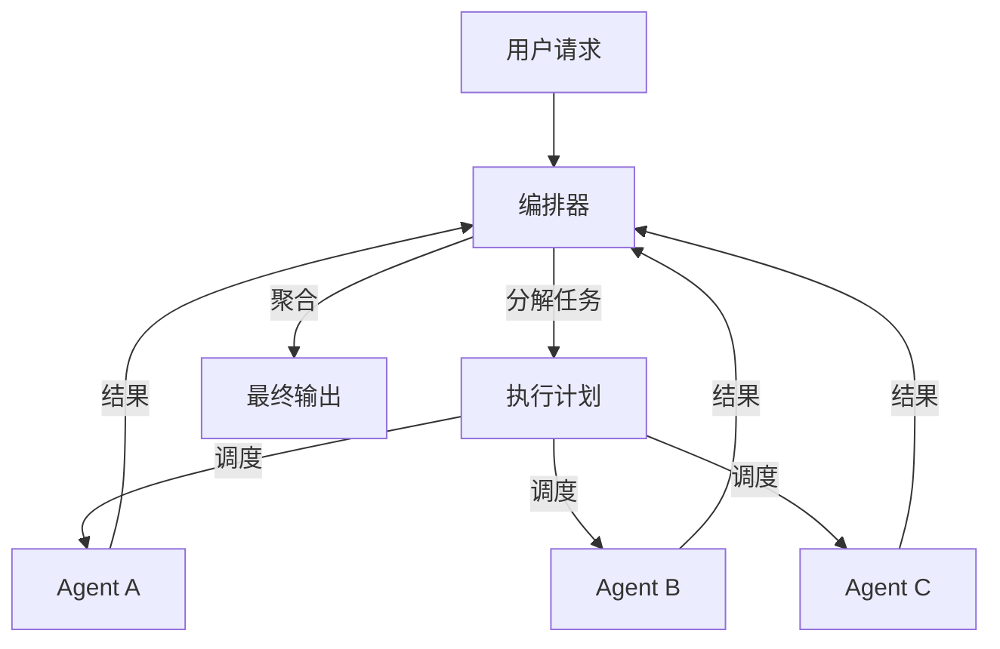

# Agent 编排

> 面向开发者的技术实战文章

## 概述

**Agent 编排（Agent Orchestration）** 是协调和管理多个 AI Agent 工作流程的技术，确保它们按正确的顺序、条件和方式协作完成任务。编排层是多 Agent 系统的"中枢神经系统"，负责调度、路由、状态管理和错误恢复。

与简单的**工作流（Workflow）** 不同，Agent 编排处理的是**智能体**而非固定步骤。每个 Agent 有自己的决策能力，编排层需要在"控制"和"自主"之间找到平衡——既不能管得太死（失去 Agent 的智能优势），也不能管得太松（导致混乱和不可预测）。

> 💡 类比理解
>
> 工作流像流水线，每个步骤是固定的；Agent 编排像交响乐团指挥，每个乐手（Agent）有自己的演奏能力，指挥负责协调节奏和声部。

## 为什么重要

### 多 Agent 系统的核心基础设施

没有编排层的多 Agent 系统会面临以下问题：

**协调混乱** Agent 之间不知道何时开始、何时结束、如何传递结果。就像没有指挥的乐团，每个乐手各弹各的。

**状态丢失** 跨 Agent 的上下文信息无法有效传递，导致每个 Agent 都在"失忆"状态下工作。

**错误传播** 一个 Agent 失败后，没有机制通知其他 Agent 调整策略，错误像多米诺骨牌一样扩散。

**资源浪费** 多个 Agent 可能重复执行相同任务，或者在等待依赖任务完成时空转。

### 核心价值

**任务分解与分配** 将复杂任务拆解为子任务，并分配给最合适的 Agent。编排层需要理解每个 Agent 的能力边界，做出合理的分配决策。

**流程控制** 管理 Agent 的执行顺序，处理并行、串行、条件分支等复杂流程。支持动态调整，根据执行结果实时修改后续流程。

**状态管理** 维护跨 Agent 的共享状态，确保信息在正确的时机传递给正确的 Agent。

**错误处理与恢复** 当某个 Agent 失败时，编排层需要决定是重试、切换到备用 Agent，还是调整整体策略。

## 核心架构

### 编排器模式（Orchestrator Pattern）

一个中心编排器（Orchestrator）负责任务分解、Agent 调度和结果聚合。



```python
class AgentOrchestrator:
    def __init__(self, agents: dict[str, Agent]):
        self.agents = agents
        self.state = SharedState()
        self.execution_log = []

    async def orchestrate(self, task: str) -> Any:
        # 1. 任务分解
        plan = await self.decompose_task(task)

        # 2. 依赖分析，构建执行图
        execution_graph = self.build_dependency_graph(plan)

        # 3. 按拓扑顺序执行
        for stage in topological_sort(execution_graph):
            # 并行执行当前阶段的所有任务
            tasks = [
                self.execute_agent(node.agent, node.input)
                for node in stage
            ]
            results = await asyncio.gather(*tasks, return_exceptions=True)

            # 4. 处理结果和异常
            for node, result in zip(stage, results):
                if isinstance(result, Exception):
                    await self.handle_failure(node, result)
                else:
                    self.state.set(node.output_key, result)

        # 5. 聚合最终结果
        return self.aggregate_results(plan)

    async def decompose_task(self, task: str) -> list[TaskNode]:
        """使用 LLM 分解任务"""
        prompt = f"""将以下任务分解为子任务，并指定每个子任务需要的 Agent。
        可用 Agent：{list(self.agents.keys())}

        任务：{task}

        输出 JSON 格式，每个子任务包含：
        - id: 唯一标识
        - description: 任务描述
        - agent: 负责的 Agent 名称
        - depends_on: 依赖的子任务 ID 列表"""
        return await self.planner_llm.invoke(prompt)
```

### 路由模式（Router Pattern）

编排器根据输入内容的特征，将请求路由到最合适的 Agent。

```python
class AgentRouter:
    def __init__(self):
        self.agents: dict[str, Agent] = {}
        self.classifier = IntentClassifier()

    def register_agent(self, category: str, agent: Agent):
        self.agents[category] = agent

    async def route(self, request: str) -> Any:
        # 分类请求类型
        category = await self.classifier.classify(request)

        # 路由到对应 Agent
        if category in self.agents:
            return await self.agents[category].execute(request)
        else:
            # 没有匹配的 Agent，使用默认或返回错误
            return await self.handle_unknown_category(request, category)

# 使用示例
router = AgentRouter()
router.register_agent("coding", CodeAgent())
router.register_agent("writing", WritingAgent())
router.register_agent("analysis", AnalysisAgent())

result = await router.route("帮我写一个 Python 函数")  # 路由到 CodeAgent
```

### 发布-订阅模式（Pub-Sub Pattern）

Agent 通过事件总线通信，编排器负责事件的分发和订阅管理。

```python
class EventBus:
    def __init__(self):
        self.subscribers: dict[str, list[Callable]] = {}

    def subscribe(self, event_type: str, handler: Callable):
        self.subscribers.setdefault(event_type, []).append(handler)

    async def publish(self, event_type: str, data: Any):
        for handler in self.subscribers.get(event_type, []):
            await handler(data)

# Agent 订阅感兴趣的事件
event_bus = EventBus()
event_bus.subscribe("data_collected", analysis_agent.handle_data)
event_bus.subscribe("analysis_complete", report_agent.handle_analysis)

# 编排器发布事件
async def orchestrator_workflow():
    data = await collection_agent.collect()
    await event_bus.publish("data_collected", data)
    # analysis_agent 会自动被触发
```

## 主流框架与实现

### LangGraph

[LangGraph](https://langchain-ai.github.io/langgraph/) 是当前最流行的 Agent 编排框架之一，基于**状态机**模型。

核心特性：
- **循环支持**：与 DAG 不同，LangGraph 支持循环，适合需要重试和反思的 Agent 场景
- **持久化**：内置检查点（Checkpoint）机制，支持中断和恢复
- **可视化**：可以生成执行图，便于调试

```python
from langgraph.graph import StateGraph, END
from langgraph.checkpoint.memory import MemorySaver
from typing import Annotated
from typing_extensions import TypedDict

class OrchestrationState(TypedDict):
    task: str
    current_agent: str
    results: Annotated[list, lambda x, y: x + y]  # 追加操作
    retry_count: int
    status: str

def route_by_intent(state: OrchestrationState) -> str:
    """根据任务内容路由到不同 Agent"""
    if "代码" in state["task"] or "code" in state["task"]:
        return "code_agent"
    elif "分析" in state["task"] or "analysis" in state["task"]:
        return "analysis_agent"
    else:
        return "general_agent"

def code_agent_node(state: OrchestrationState) -> OrchestrationState:
    result = execute_code_task(state["task"])
    state["results"].append(result)
    state["status"] = "completed"
    return state

# 构建编排图
builder = StateGraph(OrchestrationState)
builder.add_node("router", route_by_intent)
builder.add_node("code_agent", code_agent_node)
builder.add_node("analysis_agent", analysis_agent_node)
builder.add_node("general_agent", general_agent_node)

builder.add_conditional_edges(
    "router",
    route_by_intent,
    {"code_agent": "code_agent", "analysis_agent": "analysis_agent", "general_agent": "general_agent"}
)

builder.add_edge("code_agent", END)
builder.add_edge("analysis_agent", END)
builder.add_edge("general_agent", END)
builder.set_entry_point("router")

# 编译并执行
checkpointer = MemorySaver()
app = builder.compile(checkpointer=checkpointer)
result = app.invoke({"task": "分析这段代码的性能问题", "results": [], "retry_count": 0, "status": "pending"})
```

### Temporal

[Temporal](https://temporal.io/) 是面向生产的工作流编排引擎，虽然不是专门为 AI Agent 设计，但非常适合编排需要**高可靠性**的 Agent 工作流。

```python
from temporalio import workflow, activity
from datetime import timedelta

@workflow.defn
class AgentOrchestrationWorkflow:
    @workflow.run
    async def run(self, task: str) -> str:
        # 步骤 1：任务分解
        plan = await workflow.execute_activity(
            decompose_task_activity,
            task,
            start_to_close_timeout=timedelta(seconds=30)
        )

        # 步骤 2：并行执行独立任务
        parallel_tasks = [
            workflow.execute_activity(
                execute_agent_activity,
                ExecuteAgentInput(agent_name=t.agent, task=t.description),
                start_to_close_timeout=timedelta(minutes=5),
                retry_policy=RetryPolicy(maximum_attempts=3)
            )
            for t in plan.independent_tasks
        ]
        parallel_results = await asyncio.gather(*parallel_tasks)

        # 步骤 3：串行执行依赖任务
        for t in plan.dependent_tasks:
            result = await workflow.execute_activity(
                execute_agent_activity,
                ExecuteAgentInput(agent_name=t.agent, task=t.description),
                start_to_close_timeout=timedelta(minutes=5)
            )

        # 步骤 4：聚合结果
        return await workflow.execute_activity(
            aggregate_results_activity,
            {"parallel": parallel_results, "sequential": sequential_results},
            start_to_close_timeout=timedelta(seconds=30)
        )
```

Temporal 的优势：
- **自动重试**：内置重试策略，Agent 失败自动重试
- **持久化执行**：即使服务重启，工作流也能从断点恢复
- **可观测性**：内置执行历史和指标收集

### Amazon Step Functions

AWS 的 Serverless 工作流编排服务，适合云原生架构。

```json
{
  "Comment": "Agent 编排工作流",
  "StartAt": "DecomposeTask",
  "States": {
    "DecomposeTask": {
      "Type": "Task",
      "Resource": "arn:aws:lambda:us-east-1:123456789:function:decompose-task",
      "Next": "ParallelExecution"
    },
    "ParallelExecution": {
      "Type": "Parallel",
      "Branches": [
        {
          "StartAt": "ResearchAgent",
          "States": {
            "ResearchAgent": {
              "Type": "Task",
              "Resource": "arn:aws:lambda:us-east-1:123456789:function:research-agent",
              "End": true
            }
          }
        },
        {
          "StartAt": "AnalysisAgent",
          "States": {
            "AnalysisAgent": {
              "Type": "Task",
              "Resource": "arn:aws:lambda:us-east-1:123456789:function:analysis-agent",
              "End": true
            }
          }
        }
      ],
      "Next": "AggregateResults"
    },
    "AggregateResults": {
      "Type": "Task",
      "Resource": "arn:aws:lambda:us-east-1:123456789:function:aggregate-results",
      "End": true
    }
  }
}
```

## 工程实践

### 错误处理策略

Agent 编排中最常见的错误类型和处理方式：

**Agent 超时** 设置合理的超时时间，超时后重试或切换到备用 Agent。

```python
async def execute_with_timeout(agent: Agent, task: str, timeout: float = 60.0) -> Any:
    try:
        return await asyncio.wait_for(agent.execute(task), timeout=timeout)
    except asyncio.TimeoutError:
        logger.warning(f"Agent {agent.name} 超时，切换到备用 Agent")
        return await backup_agent.execute(task)
```

**Agent 返回无效结果** 验证结果格式，无效时触发重试或人工审核。

```python
async def execute_with_validation(agent: Agent, task: str, validator: Callable) -> Any:
    for attempt in range(3):
        result = await agent.execute(task)
        if validator(result):
            return result
        logger.warning(f"Agent {agent.name} 第 {attempt + 1} 次返回无效结果")

    # 3 次重试后失败，触发人工审核
    return await escalate_to_human(task, result)
```

**级联失败** 某个 Agent 失败导致下游 Agent 无法执行，需要快速失败（Fail-Fast）并通知所有相关方。

```python
class CircuitBreaker:
    def __init__(self, failure_threshold: int = 5, recovery_timeout: float = 60.0):
        self.failure_count = 0
        self.failure_threshold = failure_threshold
        self.recovery_timeout = recovery_timeout
        self.last_failure_time = None
        self.state = "closed"  # closed, open, half-open

    async def execute(self, func: Callable, *args, **kwargs) -> Any:
        if self.state == "open":
            if time.time() - self.last_failure_time > self.recovery_timeout:
                self.state = "half-open"
            else:
                raise CircuitBreakerOpenError("熔断器已打开")

        try:
            result = await func(*args, **kwargs)
            self.on_success()
            return result
        except Exception as e:
            self.on_failure()
            raise
```

### 状态持久化

长时间运行的 Agent 编排需要持久化状态，支持中断恢复。

```python
import json
from pathlib import Path

class PersistentOrchestrator:
    def __init__(self, state_dir: str = ".agent_state"):
        self.state_dir = Path(state_dir)
        self.state_dir.mkdir(exist_ok=True)

    def save_state(self, workflow_id: str, state: dict):
        state_file = self.state_dir / f"{workflow_id}.json"
        state_file.write_text(json.dumps(state, indent=2))

    def load_state(self, workflow_id: str) -> dict | None:
        state_file = self.state_dir / f"{workflow_id}.json"
        if state_file.exists():
            return json.loads(state_file.read_text())
        return None

    async def resume_workflow(self, workflow_id: str) -> Any:
        state = self.load_state(workflow_id)
        if state is None:
            raise ValueError(f"工作流 {workflow_id} 不存在")

        # 从上次中断的步骤继续
        last_completed = state["last_completed_step"]
        remaining_steps = state["plan"][last_completed + 1:]

        for step in remaining_steps:
            result = await self.execute_step(step, state)
            state["last_completed_step"] += 1
            self.save_state(workflow_id, state)

        return state["final_result"]
```

### 可观测性设计

```python
class OrchestrationTracer:
    def __init__(self):
        self.spans: list[dict] = []

    def start_span(self, span_id: str, agent_name: str, task: str):
        self.spans.append({
            "span_id": span_id,
            "agent": agent_name,
            "task": task,
            "start_time": time.time(),
            "status": "running"
        })

    def end_span(self, span_id: str, result: Any, error: Exception | None = None):
        for span in self.spans:
            if span["span_id"] == span_id:
                span["end_time"] = time.time()
                span["duration_ms"] = (span["end_time"] - span["start_time"]) * 1000
                span["status"] = "error" if error else "success"
                span["result"] = str(result)[:500] if result else None
                span["error"] = str(error) if error else None
                break

    def generate_trace(self) -> dict:
        return {
            "total_spans": len(self.spans),
            "total_duration_ms": sum(s.get("duration_ms", 0) for s in self.spans),
            "success_rate": sum(1 for s in self.spans if s["status"] == "success") / len(self.spans),
            "spans": self.spans
        }
```

> 🔧 工具推荐：[LangSmith](https://smith.langchain.com/) 提供 Agent 调用的可视化追踪，[OpenTelemetry](https://opentelemetry.io/) 可用于构建自定义的可观测性方案，[Datadog](https://www.datadoghq.com/) 提供生产级监控。

### 动态编排

静态编排（预先定义好所有步骤）不够灵活，动态编排允许在运行时根据执行结果调整流程。

```python
class DynamicOrchestrator:
    def __init__(self):
        self.agents: dict[str, Agent] = {}
        self.state = {}

    async def execute_dynamic(self, task: str) -> Any:
        # 初始规划
        plan = await self.plan(task)

        while plan.has_pending_steps():
            step = plan.get_next_step()

            # 执行当前步骤
            result = await self.execute_step(step)

            # 根据结果动态调整计划
            if result.needs_replan:
                plan = await self.replan(plan, result)
            elif result.needs_human_review:
                await self.wait_for_human(step, result)

            self.state[step.id] = result

        return self.aggregate(self.state)
```

## 与其他概念的关系

**核心依赖**：
- [多 Agent 系统](/glossary/multi-agent) — Agent 编排是多 Agent 系统的协调层，没有编排的多 Agent 系统会陷入混乱
- [工作流](/glossary/workflow) — Agent 编排是工作流的智能化升级，处理的是有决策能力的 Agent 而非固定步骤
- [工具使用](/glossary/tool-use) — 编排层需要理解每个 Agent 的工具能力，才能做出合理的调度决策

**应用场景**：
- [自主 Agent](/glossary/autonomous-agent) — 自主 Agent 内部也需要编排机制来协调自身的规划、执行、反思循环
- [人机协作](/glossary/human-in-the-loop) — 编排层可以在关键步骤插入人工审核节点

**技术基础**：
- [规划](/glossary/planning) — 编排本质上是规划能力的工程化实现
- [记忆](/glossary/memory) — 编排层需要维护跨 Agent 的共享记忆

## 延伸阅读

- [多 Agent 系统](/glossary/multi-agent)
- [LangGraph 官方文档](https://langchain-ai.github.io/langgraph/)
- [Temporal 官方文档](https://docs.temporal.io/)
- [Agent Orchestration Patterns 论文](https://arxiv.org/abs/2402.01680)
- [工作流](/glossary/workflow)
