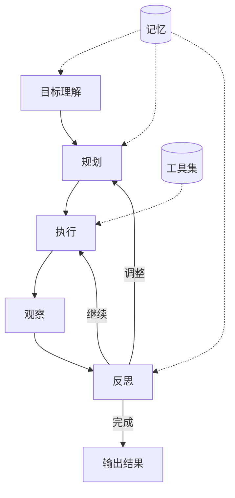

# 自主 Agent

你给它一个目标，它自己想办法搞定，不需要你一步步指挥。就像请了个靠谱的管家，你说"帮我规划一次旅行"，它自己去查机票、订酒店、排行程，最后把方案给你过目。

> 面向开发者的技术实战文章

## 概述

**自主 Agent（Autonomous Agent）** 是能够在最少或无需人类干预的情况下，自主完成复杂任务的 AI Agent。它能够理解目标、制定计划、执行行动、评估结果，并根据反馈动态调整策略。

自主 Agent 与常规 Agent 的核心区别在于**主动性**和**持续性**。常规 Agent 是"你问我答"的被动模式，自主 Agent 是"给我一个目标，我自己搞定"的主动模式。它能够自主决定何时使用工具、何时调整计划、何时终止任务。

> 💡 类比理解
>
> 常规 Agent 像实习生——你告诉他做什么，他帮你做；自主 Agent 像资深员工——你告诉他目标，他自己拆解任务、制定计划、执行并交付结果。

## 为什么需要

### 从"对话"到"行动"的范式转变

传统 AI 应用的核心是**信息处理**——回答问题、生成内容、分析数据。自主 Agent 将 AI 的能力扩展到**行动执行**——完成端到端的任务，从目标到结果全程自动化。

这种转变的意义：

**效率跃升** 人类不再需要逐步指导，只需设定目标，Agent 自主完成。一个自主 Agent 可以替代多个手动操作步骤。

**7×24 运行** 自主 Agent 可以长时间运行，处理需要数小时甚至数天的任务，不受人类工作时间限制。

**规模化** 可以同时运行多个自主 Agent，每个处理不同的任务，实现真正的并行工作。

### 核心价值

**端到端自动化** 从目标设定到结果交付，全程无需人工干预。用户只需说"帮我写一份竞品分析报告"，Agent 自动完成搜索、分析、撰写、校对全流程。

**动态适应** 能够根据环境变化和执行结果实时调整策略。如果某个步骤失败，自主 Agent 会分析原因并尝试其他方法，而不是简单报错。

**持续学习** 从历史执行中积累经验，不断改进自己的行为策略。遇到过的错误不会再犯，成功的模式会被复用。

**复杂任务处理** 能够处理涉及多个领域、多个步骤的开放式任务，这是传统自动化脚本无法做到的。

## 核心原理

### 自主 Agent 架构模型



**目标理解（Goal Understanding）** 解析用户意图，明确任务目标和约束条件。

**规划（Planning）** 将目标分解为可执行的子步骤，制定执行策略。

**执行（Execution）** 调用工具和 [Skills](/glossary/skills) 执行具体步骤。

**观察（Observation）** 收集执行结果和环境反馈。

**反思（Reflection）** 评估执行结果，判断是否需要调整计划。

> 🔗 相关词条：[规划](/glossary/planning)、[记忆](/glossary/memory)、[工具使用](/glossary/tool-use)

### 目标解析

自主 Agent 首先需要理解用户的目标。

```python
class GoalParser:
    def __init__(self, llm: Any):
        self.llm = llm

    def parse(self, user_input: str, context: dict | None = None) -> dict:
        """解析用户输入，提取目标信息"""
        prompt = f"""分析以下用户请求，提取关键信息。

用户请求：{user_input}
{"当前上下文：" + json.dumps(context) if context else ""}

请输出 JSON 格式：
- goal: 核心目标（一句话描述）
- constraints: 约束条件列表
- success_criteria: 成功标准
- domain: 所属领域
- urgency: 紧急程度（low/medium/high）"""

        return self.llm.invoke(prompt, format="json")

# 示例
parser = GoalParser(llm)
goal = parser.parse("帮我写一份关于 AI Agent 的市场分析报告，明天之前要")
# 返回：
# {
#     "goal": "撰写 AI Agent 市场分析报告",
#     "constraints": ["明天之前完成"],
#     "success_criteria": ["包含市场现状", "包含竞争分析", "包含趋势预测"],
#     "domain": "market_analysis",
#     "urgency": "high"
# }
```

### 自主规划与执行循环

自主 Agent 的核心是**规划-执行-反思**循环。

```python
class AutonomousAgent:
    def __init__(self, llm: Any, tools: list[Tool], memory: Memory):
        self.llm = llm
        self.tools = tools
        self.memory = memory
        self.max_iterations = 20

    async def run(self, goal: str) -> Any:
        """自主执行主循环"""
        # 1. 初始规划
        plan = await self.create_plan(goal)
        context = {"goal": goal, "plan": plan, "history": []}

        for iteration in range(self.max_iterations):
            # 2. 获取下一步
            next_step = self.get_next_step(plan, context)
            if next_step is None:
                return self.generate_final_output(context)

            # 3. 执行步骤
            result = await self.execute_step(next_step, context)
            context["history"].append({"step": next_step, "result": result})

            # 4. 反思
            reflection = await self.reflect(next_step, result, context)

            if reflection.needs_replan:
                # 5. 重新规划
                plan = await self.replan(plan, reflection, context)
            elif reflection.is_complete:
                return self.generate_final_output(context)

            # 6. 存储经验到记忆
            await self.memory.store_experience(next_step, result, reflection)

        # 达到最大迭代次数
        return self.generate_final_output(context, truncated=True)

    async def create_plan(self, goal: str) -> list[dict]:
        """创建初始执行计划"""
        prompt = f"""为目标制定执行计划。

目标：{goal}
可用工具：{[t.name for t in self.tools]}

请输出步骤列表，每个步骤包含：
- id: 步骤编号
- description: 步骤描述
- tool: 使用的工具名称
- expected_output: 预期输出"""
        return self.llm.invoke(prompt, format="json")

    async def reflect(self, step: dict, result: Any, context: dict) -> dict:
        """反思执行结果"""
        prompt = f"""评估以下执行结果。

步骤：{step['description']}
结果：{str(result)[:500]}
目标：{context['goal']}

请评估：
1. 步骤是否成功完成？
2. 结果是否符合预期？
3. 是否需要调整后续计划？
4. 是否已经达成整体目标？"""

        return self.llm.invoke(prompt, format="json")
```

### 错误恢复机制

自主 Agent 必须能够处理失败并恢复。

```python
class ErrorRecovery:
    def __init__(self, max_retries: int = 3):
        self.max_retries = max_retries
        self.error_patterns: dict[str, str] = {}  # 错误模式 → 恢复策略

    async def recover(self, step: dict, error: Exception, context: dict) -> dict:
        """尝试从错误中恢复"""
        error_type = type(error).__name__
        error_message = str(error)

        # 记录错误
        context.setdefault("errors", []).append({
            "step": step["id"],
            "type": error_type,
            "message": error_message,
            "timestamp": datetime.now()
        })

        # 检查是否已知错误模式
        if error_message in self.error_patterns:
            strategy = self.error_patterns[error_message]
            return await self.apply_strategy(strategy, step, context)

        # 通用恢复策略
        return await self.generic_recovery(step, error, context)

    async def generic_recovery(self, step: dict, error: Exception, context: dict) -> dict:
        """通用错误恢复"""
        # 策略 1：重试
        retry_count = context.get("retry_count", {}).get(step["id"], 0)
        if retry_count < self.max_retries:
            context.setdefault("retry_count", {})[step["id"]] = retry_count + 1
            return {"action": "retry", "message": f"第 {retry_count + 1} 次重试"}

        # 策略 2：尝试替代工具
        alternative_tool = self.find_alternative(step, context)
        if alternative_tool:
            return {
                "action": "switch_tool",
                "new_tool": alternative_tool,
                "message": f"切换到替代工具：{alternative_tool}"
            }

        # 策略 3：跳过该步骤
        return {
            "action": "skip",
            "message": f"跳过步骤 {step['id']}，继续后续步骤"
        }

    def find_alternative(self, step: dict, context: dict) -> str | None:
        """寻找替代工具"""
        current_tool = step.get("tool")
        available_tools = [t.name for t in context.get("tools", []) if t.name != current_tool]

        # 使用 LLM 选择替代工具
        prompt = f"""步骤 '{step['description']}' 原计划使用工具 {current_tool}，但该工具不可用。
        可用工具：{available_tools}
        请选择一个最合适的替代工具。"""

        result = llm.invoke(prompt)
        return result if result in available_tools else None
```

## 主流框架与实现

### AutoGPT

[AutoGPT](https://github.com/Significant-Gravitas/AutoGPT) 是最早的自主 Agent 实现之一。

```python
# AutoGPT 核心循环（简化版）
class AutoGPT:
    def __init__(self, ai_name: str, ai_role: str, goals: list[str]):
        self.ai_name = ai_name
        self.ai_role = ai_role
        self.goals = goals
        self.command_registry = CommandRegistry()
        self.memory = VectorMemory()

    def run(self, continuous_mode: bool = True):
        """主循环"""
        while True:
            # 生成下一步行动
            prompt = self.generate_prompt()
            response = self.llm.invoke(prompt)

            # 解析命令
            command_name, arguments = self.parse_command(response)

            # 执行命令
            result = self.command_registry.execute(command_name, arguments)

            # 存储到记忆
            self.memory.add(f"执行了 {command_name}，结果：{result}")

            # 检查目标是否完成
            if self.goals_accomplished():
                break

            if not continuous_mode:
                user_input = input("按回车继续，或输入指令：")
                if user_input:
                    self.memory.add(f"用户指令：{user_input}")
```

### CrewAI 自主模式

[CrewAI](https://docs.crewai.com/) 支持自主执行的 Crew。

```python
from crewai import Agent, Task, Crew, Process

# 定义自主 Agent
researcher = Agent(
    role="自主研究员",
    goal="独立完成市场调研任务",
    backstory="你是一位经验丰富的市场研究员，能够自主制定研究计划并执行",
    tools=[search_tool, web_scraper, data_analyzer],
    allow_delegation=False,  # 自主执行，不委托
    verbose=True
)

# 定义任务（Agent 自主决定如何完成）
research_task = Task(
    description="调研 AI Agent 市场的现状、主要玩家和未来趋势",
    agent=researcher,
    expected_output="一份完整的市场调研报告"
)

# 创建自主执行的 Crew
crew = Crew(
    agents=[researcher],
    tasks=[research_task],
    process=Process.sequential,
    verbose=True
)

# Agent 会自主决定如何使用工具、如何组织报告
result = crew.kickoff()
```

### LangGraph 自主 Agent

使用 LangGraph 构建自主 Agent。

```python
from langgraph.graph import StateGraph, END
from typing import TypedDict, Annotated

class AutonomousState(TypedDict):
    goal: str
    plan: list[dict]
    current_step: int
    history: Annotated[list, lambda x, y: x + y]
    result: str
    is_complete: bool

def planner_node(state: AutonomousState) -> AutonomousState:
    """规划节点"""
    if not state["plan"]:
        plan = create_plan(state["goal"])
        state["plan"] = plan
        state["current_step"] = 0
    return state

def executor_node(state: AutonomousState) -> AutonomousState:
    """执行节点"""
    if state["current_step"] >= len(state["plan"]):
        state["is_complete"] = True
        return state

    step = state["plan"][state["current_step"]]
    result = execute_step(step, state["history"])
    state["history"].append({"step": step, "result": result})
    state["current_step"] += 1
    return state

def reflector_node(state: AutonomousState) -> AutonomousState:
    """反思节点"""
    if state["current_step"] > 0:
        last_result = state["history"][-1]["result"]
        reflection = reflect(last_result, state["goal"])

        if reflection.get("needs_replan"):
            state["plan"] = replan(state["plan"], reflection, state["history"])

        if reflection.get("is_complete"):
            state["is_complete"] = True

    return state

def should_continue(state: AutonomousState) -> str:
    if state["is_complete"]:
        return END
    if state["current_step"] >= len(state["plan"]):
        return END
    return "executor"

# 构建自主 Agent 图
builder = StateGraph(AutonomousState)
builder.add_node("planner", planner_node)
builder.add_node("executor", executor_node)
builder.add_node("reflector", reflector_node)

builder.add_edge("planner", "executor")
builder.add_edge("executor", "reflector")
builder.add_conditional_edges("reflector", should_continue)
builder.set_entry_point("planner")

app = builder.compile()
result = app.invoke({
    "goal": "分析某公司的竞品情况",
    "plan": [],
    "current_step": 0,
    "history": [],
    "result": "",
    "is_complete": False
})
```

## 实施步骤

### 步骤 1：定义目标解析器

```python
class GoalParser:
    def parse(self, user_input: str) -> dict:
        """解析用户输入，提取目标、约束、成功标准"""
        prompt = f"""分析以下请求，提取关键信息：
        用户请求：{user_input}
        输出 JSON：goal, constraints, success_criteria, domain"""
        return self.llm.invoke(prompt, format="json")
```

### 步骤 2：实现规划模块

```python
class Planner:
    def create_plan(self, goal: str, tools: list[str]) -> list[dict]:
        """将目标分解为可执行步骤"""
        prompt = f"""为目标制定计划：
        目标：{goal}
        可用工具：{tools}
        输出步骤列表，包含 id, description, tool, expected_output"""
        return self.llm.invoke(prompt, format="json")
```

### 步骤 3：构建执行循环

```python
class AutonomousAgent:
    async def run(self, goal: str) -> Any:
        plan = await self.planner.create_plan(goal)
        context = {"goal": goal, "plan": plan, "history": []}

        for _ in range(self.max_iterations):
            step = self.get_next_step(plan, context)
            if step is None:
                return self.generate_output(context)

            result = await self.execute_step(step)
            context["history"].append({"step": step, "result": result})

            reflection = await self.reflect(step, result, context)
            if reflection.needs_replan:
                plan = await self.planner.replan(plan, reflection)
            elif reflection.is_complete:
                return self.generate_output(context)
```

### 步骤 4：添加反思机制

```python
class Reflector:
    async def reflect(self, step: dict, result: Any, goal: str) -> dict:
        """评估执行结果，判断是否需要调整"""
        prompt = f"""评估执行结果：
        步骤：{step['description']}
        结果：{result}
        目标：{goal}
        输出：success, needs_replan, is_complete, reason"""
        return self.llm.invoke(prompt, format="json")
```

### 步骤 5：实现错误恢复

- **重试机制**：失败后自动重试
- **替代方案**：尝试其他工具或方法
- **跳过策略**：无法解决时跳过继续

### 步骤 6：设置安全边界

```python
class SafetyGuardrails:
    restricted_operations = {"delete_data", "send_email", "deploy"}
    max_budget = 10.0  # 美元
    max_runtime = 3600  # 秒

    def check(self, step: dict, context: dict) -> bool:
        if step.get("operation") in self.restricted_operations:
            return False
        if context.get("total_cost", 0) > self.max_budget:
            return False
        return True
```

## 主流框架对比

| 框架 | 核心模式 | 特点 | 适用场景 |
|------|---------|------|---------|
| **AutoGPT** | 自主循环 | 早期实现、简单直接 | 实验性项目 |
| **CrewAI** | 角色协作 | 易用、文档好 | 内容创作、调研 |
| **LangGraph** | 状态机 | 灵活可控、支持循环 | 复杂工作流 |
| **OpenAI Swarm** | 轻量编排 | 简单、官方支持 | 简单多 Agent |
| **Devin** | 全自主开发 | 专业领域、强大 | 软件开发 |

## 最佳实践

### 安全边界

自主 Agent 拥有执行能力，必须设置安全边界。

```python
class SafetyGuardrails:
    def __init__(self):
        self.restricted_operations: set[str] = {
            "delete_production_data",
            "send_external_email",
            "deploy_to_production",
            "access_financial_data"
        }
        self.max_budget: float = 10.0  # 最大 API 花费（美元）
        self.max_runtime: float = 3600  # 最大运行时间（秒）

    def check_before_execute(self, step: dict, context: dict) -> bool:
        """执行前安全检查"""
        # 检查是否为受限操作
        if step.get("operation") in self.restricted_operations:
            return False

        # 检查预算
        if context.get("total_cost", 0) > self.max_budget:
            return False

        # 检查运行时间
        if context.get("runtime", 0) > self.max_runtime:
            return False

        return True

    def check_output(self, output: str) -> dict:
        """输出安全检查"""
        issues = []

        # 检查是否包含敏感信息
        if contains_sensitive_data(output):
            issues.append("输出包含敏感信息")

        # 检查是否包含有害内容
        if contains_harmful_content(output):
            issues.append("输出包含有害内容")

        return {"safe": len(issues) == 0, "issues": issues}
```

> ⚠️ 安全警告：自主 Agent 的生产部署必须设置严格的安全边界。限制可执行的操作类型、设置预算上限、限制运行时间、对所有输出进行安全检查。

### 成本控制

自主 Agent 可能产生大量 API 调用，需要成本控制。

```python
class CostController:
    def __init__(self, budget: float = 5.0):
        self.budget = budget
        self.spent = 0.0
        self.call_count = 0

    def record_call(self, model: str, input_tokens: int, output_tokens: int):
        """记录 API 调用成本"""
        cost = calculate_cost(model, input_tokens, output_tokens)
        self.spent += cost
        self.call_count += 1

    def is_within_budget(self) -> bool:
        return self.spent < self.budget

    def get_remaining_budget(self) -> float:
        return self.budget - self.spent

    def optimize_model_selection(self, task_complexity: str) -> str:
        """根据任务复杂度选择模型，控制成本"""
        if task_complexity == "simple":
            return "gpt-4o-mini"  # 便宜
        elif task_complexity == "medium":
            return "gpt-4o"
        else:
            return "gpt-4o"  # 复杂任务用好模型

# 在自主 Agent 中使用
class CostAwareAgent(AutonomousAgent):
    def __init__(self, *args, budget: float = 5.0, **kwargs):
        super().__init__(*args, **kwargs)
        self.cost_controller = CostController(budget)

    async def run(self, goal: str) -> Any:
        if not self.cost_controller.is_within_budget():
            return f"预算已用完（${self.cost_controller.budget}），任务终止"

        # 根据任务复杂度选择模型
        complexity = self.estimate_complexity(goal)
        self.llm.model = self.cost_controller.optimize_model_selection(complexity)

        result = await super().run(goal)

        # 记录成本
        self.cost_controller.record_call(
            self.llm.model,
            self.llm.last_input_tokens,
            self.llm.last_output_tokens
        )

        return result
```

### 可观测性

自主 Agent 的执行过程需要完整的可观测性。

```python
class AutonomousAgentTracer:
    def __init__(self):
        self.trace: list[dict] = []

    def record_step(self, step_type: str, details: dict):
        self.trace.append({
            "type": step_type,
            "details": details,
            "timestamp": datetime.now().isoformat(),
            "cost": details.get("cost", 0)
        })

    def generate_report(self) -> dict:
        total_steps = len(self.trace)
        total_cost = sum(t["cost"] for t in self.trace)

        step_types = {}
        for t in self.trace:
            step_types[t["type"]] = step_types.get(t["type"], 0) + 1

        return {
            "total_steps": total_steps,
            "total_cost": total_cost,
            "step_distribution": step_types,
            "timeline": self.trace
        }

    def visualize(self) -> str:
        """生成可视化报告"""
        report = self.generate_report()
        return f"""
自主 Agent 执行报告
==================
总步骤数：{report['total_steps']}
总成本：${report['total_cost']:.2f}
步骤分布：{report['step_distribution']}

执行时间线：
{chr(10).join(f"  [{t['timestamp']}] {t['type']}: {t['details'].get('summary', '')}" for t in self.trace)}
        """
```

> 🔧 工具推荐：[LangSmith](https://smith.langchain.com/) 提供完整的 Agent 执行追踪，[OpenLIT](https://github.com/openlit/openlit) 是开源的 LLM 可观测性工具。

### 评估与测试

自主 Agent 的评估比常规 Agent 更复杂，因为执行路径是不确定的。

```python
class AutonomousAgentEvaluator:
    def __init__(self, agent: AutonomousAgent):
        self.agent = agent

    async def evaluate(self, test_cases: list[dict]) -> list[dict]:
        """评估自主 Agent 的表现"""
        results = []

        for test_case in test_cases:
            result = await self.evaluate_single(test_case)
            results.append(result)

        return results

    async def evaluate_single(self, test_case: dict) -> dict:
        """评估单个测试用例"""
        goal = test_case["goal"]
        expected_outcome = test_case["expected_outcome"]

        # 执行
        start_time = time.time()
        actual_result = await self.agent.run(goal)
        runtime = time.time() - start_time

        # 评估结果质量
        quality_score = await self.evaluate_quality(actual_result, expected_outcome)

        # 评估效率
        efficiency_score = self.evaluate_efficiency(runtime, self.agent.tracer)

        return {
            "goal": goal,
            "success": quality_score > 0.7,
            "quality_score": quality_score,
            "efficiency_score": efficiency_score,
            "runtime": runtime,
            "cost": self.agent.tracer.generate_report()["total_cost"],
            "steps_taken": self.agent.tracer.generate_report()["total_steps"]
        }

    async def evaluate_quality(self, actual: str, expected: str) -> float:
        """使用 LLM 评估输出质量"""
        prompt = f"""评估以下输出是否满足预期目标。

预期：{expected}
实际：{actual}

请给出 0-1 的评分，1 表示完全满足预期。"""

        score = float(self.agent.llm.invoke(prompt))
        return max(0, min(1, score))
```

## 常见问题与避坑

### Q1：自主 Agent 陷入死循环怎么办？

- 设置**最大迭代次数**
- 检测**重复操作**模式
- 添加**终止条件**判断

### Q2：如何控制 API 成本？

- 使用**小模型**处理简单任务
- 设置**预算上限**
- **缓存**重复查询结果

### Q3：Agent 执行结果不符合预期怎么办？

- 优化**目标描述**的清晰度
- 添加更多**约束条件**
- 提供**示例**指导行为

### Q4：如何保证自主 Agent 的安全性？

- 限制**可执行操作**类型
- 设置**预算和时间**上限
- 对所有**输出进行审查**
- 关键操作需要**人工审批**

### Q5：如何评估自主 Agent 的表现？

- **成功率**：目标达成比例
- **效率**：完成任务的步数和耗时
- **成本**：API 调用花费
- **质量**：输出结果评分

:::warning 常见陷阱
- **缺乏安全边界**：Agent 可能执行危险操作
- **成本失控**：长时间运行产生高额费用
- **死循环**：Agent 无法终止任务
- **目标漂移**：执行过程中偏离原始目标
- **缺乏监控**：出问题后无法定位原因
:::

## 与其他概念的关系

**核心依赖**：

- [Agent](/glossary/agent) — 自主 Agent 是 Agent 能力的高级形态，建立在基础 Agent 能力之上
- [规划](/glossary/planning) — 规划是自主 Agent 的核心能力，决定 Agent 如何分解和执行任务
- [记忆](/glossary/memory) — 自主 Agent 需要长期记忆来积累经验和持续改进
- [工具使用](/glossary/tool-use) — 工具使用是自主 Agent 执行任务的主要手段

**应用场景**：

- [多 Agent 系统](/glossary/multi-agent) — 多个自主 Agent 可以组成更强大的协作系统
- [人机协作](/glossary/human-in-the-loop) — 自主 Agent 与人机协作形成光谱，实际系统通常介于两者之间
- [Agent 编排](/glossary/agent-orchestration) — 自主 Agent 内部也需要编排机制来协调自身的执行循环

**技术基础**：

- [Skills](/glossary/skills) — 自主 Agent 通过组合 Skills 构建完整的能力体系
- [Commands](/glossary/commands) — 用户可以通过 Commands 向自主 Agent 下达目标指令

## 延伸阅读

- [Agent](/glossary/agent)
- [规划](/glossary/planning)
- [记忆](/glossary/memory)
- [AutoGPT GitHub 仓库](https://github.com/Significant-Gravitas/AutoGPT)
- [CrewAI 官方文档](https://docs.crewai.com/)
- [Generative Agents 论文](https://arxiv.org/abs/2304.03442)
