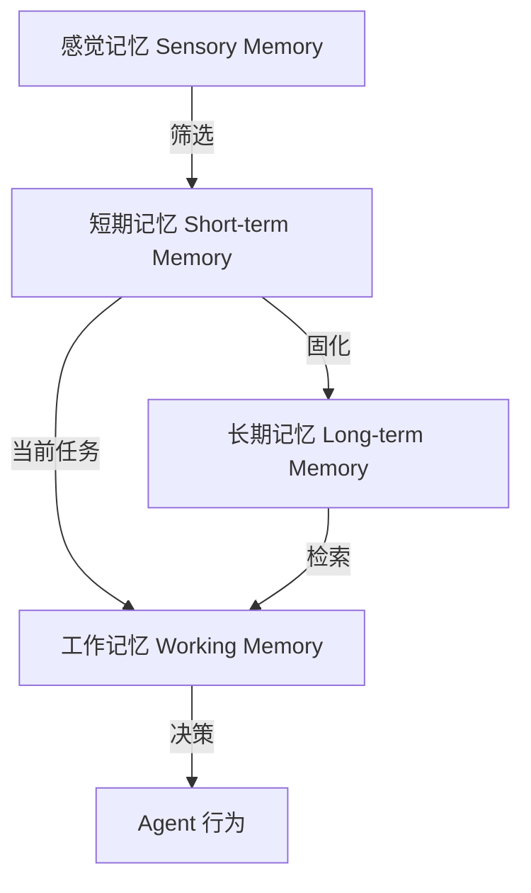

# 记忆

让 AI 能"记住"之前说过什么、做过什么、你喜欢什么。没有记忆的 AI 每次对话都是初次见面，有了记忆它就能像老朋友一样，了解你的偏好、延续之前的话题、越用越懂你。

> 面向开发者的技术实战文章

## 概述

**记忆（Memory）** 是 AI Agent 存储、检索和利用信息的能力，包括短期记忆（当前会话上下文）和长期记忆（跨会话积累的知识和经验）。记忆是 Agent 实现连续性、个性化和持续学习的基础设施。

大语言模型本身是**无状态**的——每次对话都是全新的开始，模型不会记住之前的交互。记忆机制通过在模型之外维护状态，赋予 Agent "记住"的能力。

> 💡 核心理解
>
> LLM 的大脑像金鱼——每次对话后一切归零。记忆系统就是给金鱼配一个笔记本，让它每次对话前翻一翻，知道之前说了什么、做了什么。

## 为什么需要

### 无状态模型的能力瓶颈

没有记忆的 Agent 面临以下根本性问题：

**上下文断裂** 每次对话都从零开始，用户需要重复提供背景信息。"我之前说过我的项目是用 Python 写的"——没有记忆的 Agent 完全不知道。

**经验无法积累** 每次遇到相同问题都从头解决，不会从历史经验中学习。用户反复纠正的错误，Agent 下次还会犯。

**个性化缺失** 无法记住用户的偏好、习惯和历史行为，每次交互都像陌生人。

**长任务无法完成** 需要多轮交互才能完成的任务，中间状态无法保持。

### 核心价值

**上下文连续性** 保持对话和任务的连续性，用户不需要重复提供已知信息。

**知识积累** 从历史交互中提取有价值的信息，形成可复用的知识库。

**个性化体验** 根据用户的历史行为和偏好调整响应方式，提供定制化服务。

**任务延续** 支持长时间运行的多步骤任务，即使跨会话也能继续。

## 核心原理

### 记忆分层模型

Agent 的记忆系统通常分为四个层次：



**感觉记忆（Sensory Memory）** 接收所有输入信息，但只保留极短时间（几秒）。在 Agent 中对应原始的用户输入和工具输出。

**短期记忆（Short-term Memory）** 当前会话的上下文信息，通常存储在对话历史中。受限于上下文窗口大小。

**长期记忆（Long-term Memory）** 持久化的知识和经验，跨会话保留。通常使用向量数据库存储。

**工作记忆（Working Memory）** 当前任务需要的临时信息，是从长期记忆中检索出来、放到短期记忆中使用的部分。

### 短期记忆实现

短期记忆最简单，就是维护对话历史。

```python
class ShortTermMemory:
    def __init__(self, max_tokens: int = 4000):
        self.messages: list[dict] = []
        self.max_tokens = max_tokens
        self.token_counter = TokenCounter()

    def add_message(self, role: str, content: str):
        self.messages.append({"role": role, "content": content})
        self._trim_if_needed()

    def _trim_if_needed(self):
        """当超过最大 token 数时，从最早的消息开始删除"""
        while self.token_counter.count(self.messages) > self.max_tokens:
            # 保留系统消息，删除最早的对话轮次
            if len(self.messages) > 1 and self.messages[0]["role"] != "system":
                self.messages.pop(0)
            else:
                break

    def get_context(self) -> list[dict]:
        return self.messages.copy()
```

短期记忆的关键策略：

- **滑动窗口** 只保留最近的 N 条消息
- **摘要压缩** 将早期对话压缩为摘要，节省 token
- **重要信息保留** 标记关键信息（如用户偏好），不被删除

```python
class SummarizingMemory:
    def __init__(self, llm: Any, max_messages: int = 10):
        self.llm = llm
        self.messages: list[dict] = []
        self.summary: str = ""
        self.max_messages = max_messages

    def add_message(self, role: str, content: str):
        self.messages.append({"role": role, "content": content})

        if len(self.messages) > self.max_messages:
            # 触发摘要生成
            old_messages = self.messages[:-self.max_messages]
            self.summary = self._generate_summary(old_messages)
            self.messages = [
                {"role": "system", "content": f"对话摘要：{self.summary}"},
                *self.messages[-self.max_messages:]
            ]

    def _generate_summary(self, messages: list[dict]) -> str:
        prompt = f"请总结以下对话的关键信息：\n{messages}"
        return self.llm.invoke(prompt)
```

### 长期记忆实现

长期记忆的核心是**向量检索**，将信息嵌入（Embedding）后存储，通过语义相似度检索。

```python
from langchain_core.vectorstores import InMemoryVectorStore
from langchain_openai import OpenAIEmbeddings

class LongTermMemory:
    def __init__(self):
        self.embeddings = OpenAIEmbeddings()
        self.vectorstore = InMemoryVectorStore(self.embeddings)

    def store(self, text: str, metadata: dict | None = None):
        """存储记忆"""
        self.vectorstore.add_texts([text], metadatas=[metadata or {}])

    def retrieve(self, query: str, top_k: int = 5) -> list[str]:
        """检索相关记忆"""
        results = self.vectorstore.similarity_search(query, k=top_k)
        return [doc.page_content for doc in results]

    def store_conversation(self, user_input: str, agent_response: str):
        """存储一轮对话"""
        self.store(
            f"用户：{user_input}\nAgent：{agent_response}",
            metadata={"type": "conversation", "timestamp": datetime.now().isoformat()}
        )

    def store_fact(self, fact: str, source: str):
        """存储事实性知识"""
        self.store(
            fact,
            metadata={"type": "fact", "source": source, "timestamp": datetime.now().isoformat()}
        )
```

长期记忆的关键设计点：

- **分块策略** 将长文本切分为合适大小的块（通常 500-1000 token）
- **元数据过滤** 存储时添加类型、时间、来源等元数据，检索时可过滤
- **记忆衰减** 旧的记忆可以降低权重，但不应直接删除

### 情景记忆（Episodic Memory）

情景记忆记录特定场景的经历和结果，让 Agent 从历史经验中学习。

```python
class EpisodicMemory:
    def __init__(self):
        self.episodes: list[dict] = []
        self.vectorstore = InMemoryVectorStore(OpenAIEmbeddings())

    def store_episode(self, task: str, action: str, result: str, success: bool):
        """存储一次经历"""
        episode = {
            "task": task,
            "action": action,
            "result": result,
            "success": success,
            "timestamp": datetime.now().isoformat()
        }
        self.episodes.append(episode)

        # 向量化存储，便于检索
        text = f"任务：{task}\n行动：{action}\n结果：{result}"
        self.vectorstore.add_texts([text], metadatas=[{"success": success}])

    def find_similar_episodes(self, task: str, top_k: int = 3) -> list[dict]:
        """查找类似经历"""
        results = self.vectorstore.similarity_search(task, k=top_k)
        indices = [doc.metadata["id"] for doc in results]
        return [self.episodes[i] for i in indices if i < len(self.episodes)]

    def get_lessons(self, task: str) -> str:
        """从类似经历中提取经验教训"""
        episodes = self.find_similar_episodes(task)
        successes = [e for e in episodes if e["success"]]
        failures = [e for e in episodes if not e["success"]]

        lessons = []
        if successes:
            lessons.append("成功的做法：")
            for e in successes:
                lessons.append(f"- {e['action']}")
        if failures:
            lessons.append("避免的做法：")
            for e in failures:
                lessons.append(f"- {e['action']}（失败原因：{e['result']}）")

        return "\n".join(lessons)
```

## 主流框架与实现

### LangChain Memory

[LangChain](https://python.langchain.com/) 提供了多种记忆实现。

```python
from langchain.memory import ConversationBufferMemory, ConversationSummaryMemory
from langchain.chains import ConversationChain

# 简单对话记忆
buffer_memory = ConversationBufferMemory()

# 摘要对话记忆（适合长对话）
summary_memory = ConversationSummaryMemory(llm=ChatOpenAI())

# 带向量存储的记忆
from langchain.memory import VectorStoreRetrieverMemory
retriever_memory = VectorStoreRetrieverMemory(
    retriever=InMemoryVectorStore(OpenAIEmbeddings()).as_retriever()
)

# 组合使用
from langchain.memory import CombinedMemory
combined = CombinedMemory(memories=[buffer_memory, retriever_memory])
```

### Mem0

[Mem0](https://docs.mem0.ai/) 是专门面向 AI Agent 的记忆层，支持自动提取和存储记忆。

```python
from mem0 import Memory

# 初始化
memory = Memory()

# 添加记忆（自动提取关键信息）
memory.add(
    "我喜欢吃意大利面，对花生过敏",
    user_id="user_123"
)

# 检索相关记忆
memories = memory.search("有什么推荐的餐厅？", user_id="user_123")
# 返回：["用户喜欢吃意大利面", "用户对花生过敏"]

# 更新记忆
memory.update(
    memory_id=memories[0]["id"],
    data="我现在也喜欢寿司了"
)

# 删除记忆
memory.delete(memory_id=memories[0]["id"])
```

Mem0 的特点：

- **自动提取** 从对话中自动识别和提取有价值的信息
- **用户画像** 为每个用户维护独立的记忆空间
- **记忆管理** 支持更新、删除、去重等操作

### Zep

[Zep](https://www.getzep.com/) 是面向生产环境的长期记忆平台。

```python
from zep_python import ZepClient

client = ZepClient(api_key="your_api_key")

# 添加消息
client.memory.add_messages(
    session_id="user_123",
    messages=[
        {"role": "human", "content": "我在做一个 Python 项目"},
        {"role": "ai", "content": "听起来很有趣！能告诉我更多关于这个项目的信息吗？"}
    ]
)

# 获取记忆摘要
memory = client.memory.get_memory(session_id="user_123")
print(memory.summary)  # 自动生成的对话摘要

# 搜索记忆
results = client.memory.search_memory(
    session_id="user_123",
    query="用户的项目技术栈"
)
```

## 实施步骤

### 步骤 1：选择记忆类型

根据需求选择记忆层级：

| 记忆类型 | 存储内容 | 存储方式 | 保留时间 |
|---------|---------|---------|---------|
| 短期记忆 | 当前对话 | 内存列表 | 会话期间 |
| 长期记忆 | 知识经验 | 向量数据库 | 持久化 |
| 情景记忆 | 历史经历 | 向量+元数据 | 持久化 |
| 语义记忆 | 事实知识 | 知识图谱/向量库 | 持久化 |

### 步骤 2：实现短期记忆

```python
class ShortTermMemory:
    def __init__(self, max_messages: int = 20):
        self.messages = []
        self.max_messages = max_messages

    def add(self, role: str, content: str):
        self.messages.append({"role": role, "content": content})
        if len(self.messages) > self.max_messages:
            self.messages = self.messages[-self.max_messages:]
```

### 步骤 3：配置向量存储

```python
from langchain_core.vectorstores import InMemoryVectorStore
from langchain_openai import OpenAIEmbeddings

vectorstore = InMemoryVectorStore(OpenAIEmbeddings())

def store_memory(text: str, metadata: dict):
    vectorstore.add_texts([text], metadatas=[metadata])

def retrieve_memory(query: str, k: int = 5) -> list[str]:
    results = vectorstore.similarity_search(query, k=k)
    return [doc.page_content for doc in results]
```

### 步骤 4：实现记忆检索

```python
def get_relevant_memories(user_input: str, context: dict) -> str:
    """检索与当前输入相关的记忆"""
    memories = retrieve_memory(user_input, k=3)

    # 过滤过期记忆
    active_memories = [
        m for m in memories
        if not is_expired(m.metadata.get("expires_at"))
    ]

    return "\n".join(active_memories)
```

### 步骤 5：添加记忆管理

- **压缩**：定期将早期对话压缩为摘要
- **遗忘**：基于重要性、频率、时效性删除低价值记忆
- **更新**：当信息变化时更新记忆

## 主流框架对比

| 框架 | 特点 | 适用场景 | 成本 |
|------|------|---------|------|
| **LangChain Memory** | 多种实现、易集成 | 快速原型 | 低 |
| **Mem0** | 自动提取、用户画像 | 个性化应用 | 中 |
| **Zep** | 生产级、自动摘要 | 企业应用 | 中-高 |
| **Letta** | 结构化记忆、主动管理 | 复杂 Agent | 中 |

## 最佳实践

### 记忆检索优化

检索质量直接影响 Agent 的表现。以下策略可以提升检索效果：

**混合检索** 结合向量检索和关键词检索。

```python
class HybridRetriever:
    def __init__(self, vectorstore, keyword_index):
        self.vectorstore = vectorstore
        self.keyword_index = keyword_index

    def retrieve(self, query: str, top_k: int = 5) -> list[str]:
        # 向量检索
        vector_results = self.vectorstore.similarity_search(query, k=top_k * 2)

        # 关键词检索
        keyword_results = self.keyword_index.search(query, limit=top_k * 2)

        # 融合排序（RRF: Reciprocal Rank Fusion）
        combined = self.rrf_rank(vector_results, keyword_results, k=top_k)
        return combined
```

**查询改写** 在检索前改写查询，提高匹配度。

```python
def rewrite_query(query: str, llm: Any) -> str:
    """将用户查询改写为更适合检索的形式"""
    prompt = f"""将以下查询改写为 3 个不同的版本，用于向量检索。
    保留核心语义，但使用不同的表达方式。

    原始查询：{query}

    输出格式：每行一个改写版本"""

    rewrites = llm.invoke(prompt).strip().split("\n")
    return rewrites
```

**元数据过滤** 利用存储时添加的元数据缩小检索范围。

```python
def retrieve_with_filter(query: str, filters: dict) -> list[str]:
    """带过滤条件的检索"""
    return vectorstore.similarity_search(
        query,
        k=5,
        filter=filters  # 如 {"type": "fact", "source": "user_input"}
    )
```

### 记忆压缩

当记忆量过大时，需要压缩以节省上下文窗口。

```python
class MemoryCompressor:
    def __init__(self, llm: Any):
        self.llm = llm

    def compress(self, memories: list[str], target_tokens: int) -> str:
        """将多条记忆压缩为简洁的摘要"""
        combined = "\n".join(memories)

        prompt = f"""将以下信息压缩为不超过 {target_tokens} token 的摘要。
        保留所有关键事实和重要细节，去除冗余和重复内容。

        原始信息：
        {combined}

        压缩后的摘要："""

        return self.llm.invoke(prompt)

    def hierarchical_compress(self, memories: list[str], levels: int = 2) -> str:
        """分层压缩：先局部压缩，再全局压缩"""
        if len(memories) <= 1:
            return memories[0] if memories else ""

        # 第一层：分组压缩
        group_size = max(1, len(memories) // levels)
        groups = [memories[i:i+group_size] for i in range(0, len(memories), group_size)]
        compressed_groups = [
            self.compress(group, target_tokens=200)
            for group in groups
        ]

        # 第二层：全局压缩
        return self.compress(compressed_groups, target_tokens=500)
```

### 记忆遗忘策略

不是所有记忆都值得保留，需要合理的遗忘策略。

```python
class MemoryManager:
    def __init__(self, max_memories: int = 1000):
        self.memories: list[dict] = []
        self.max_memories = max_memories

    def add(self, text: str, importance: float = 1.0):
        """添加记忆，importance 范围 0-1"""
        self.memories.append({
            "text": text,
            "importance": importance,
            "access_count": 0,
            "created_at": time.time(),
            "last_accessed": time.time()
        })

        # 超过容量时清理
        if len(self.memories) > self.max_memories:
            self._forget()

    def record_access(self, index: int):
        """记录记忆被访问"""
        self.memories[index]["access_count"] += 1
        self.memories[index]["last_accessed"] = time.time()

    def _forget(self):
        """遗忘策略：删除最不重要的记忆"""
        # 计算每个记忆的分数
        for m in self.memories:
            recency = time.time() - m["created_at"]
            frequency = m["access_count"]
            m["score"] = m["importance"] * 0.5 + frequency * 0.3 + (1 / (recency + 1)) * 0.2

        # 删除分数最低的
        self.memories.sort(key=lambda m: m["score"])
        self.memories = self.memories[len(self.memories) // 4:]  # 删除最差的 25%
```

> 🔧 最佳实践：记忆遗忘应该基于多维度评估——重要性（内容价值）、频率（访问次数）、时效性（创建时间）。不要简单地按时间删除。

### 记忆安全与隐私

记忆系统存储了大量用户信息，需要严格的安全措施：

**数据隔离** 不同用户的记忆必须严格隔离。

**加密存储** 敏感信息加密存储。

**用户控制** 允许用户查看、编辑、删除自己的记忆。

```python
class SecureMemory:
    def __init__(self):
        self.user_stores: dict[str, VectorStore] = {}

    def get_user_store(self, user_id: str) -> VectorStore:
        """获取用户的独立记忆存储"""
        if user_id not in self.user_stores:
            self.user_stores[user_id] = InMemoryVectorStore(OpenAIEmbeddings())
        return self.user_stores[user_id]

    def delete_user_memories(self, user_id: str):
        """用户请求删除所有记忆（GDPR 合规）"""
        if user_id in self.user_stores:
            del self.user_stores[user_id]

    def export_user_memories(self, user_id: str) -> list[str]:
        """导出用户所有记忆（数据可携带权）"""
        store = self.get_user_store(user_id)
        return [doc.page_content for doc in store.similarity_search("", k=10000)]
```

## 常见问题与避坑

### Q1：记忆太多影响性能怎么办？

- 使用**混合检索**（向量+关键词）
- 添加**元数据过滤**缩小范围
- 定期**压缩**旧记忆

### Q2：如何避免检索到不相关记忆？

- 优化**分块策略**（500-1000 token）
- 使用**查询改写**提高匹配度
- 添加**相关性评分**过滤低分结果

### Q3：记忆系统如何保证隐私？

- **用户隔离**：不同用户记忆严格分开
- **加密存储**：敏感信息加密
- **用户控制**：允许查看、编辑、删除

### Q4：上下文窗口不够用怎么办？

- 使用**摘要压缩**早期对话
- **分层检索**：先检索摘要，再按需检索详情
- **选择性注入**：只注入最相关的记忆

### Q5：记忆衰减策略怎么设计？

```python
# 多维度评估记忆价值
def calculate_memory_score(memory: dict) -> float:
    importance = memory.get("importance", 0.5)
    frequency = memory.get("access_count", 0)
    recency = time.time() - memory["created_at"]

    return importance * 0.5 + frequency * 0.3 + (1 / (recency + 1)) * 0.2
```

:::warning 常见陷阱
- **过度存储**：所有信息都存导致检索质量下降
- **缺乏更新**：过时信息未被清理
- **隐私泄露**：不同用户记忆未隔离
- **检索低效**：未做索引优化导致延迟高
:::

## 与其他概念的关系

**核心依赖**：

- [Agent](/glossary/agent) — 记忆是 Agent 实现连续性和个性化的基础设施
- [上下文窗口](/glossary/context-window) — 短期记忆受限于上下文窗口大小，需要压缩和摘要策略
- [Embedding](/glossary/embedding) — 长期记忆依赖 Embedding 技术实现语义检索

**应用场景**：

- [自主 Agent](/glossary/autonomous-agent) — 自主 Agent 需要长期记忆来积累经验、持续改进
- [多 Agent 系统](/glossary/multi-agent) — Agent 间共享记忆是实现深度协作的关键

**技术基础**：

- [规划](/glossary/planning) — 规划需要记忆来保持对之前步骤和结果的了解
- [工具使用](/glossary/tool-use) — 工具调用的历史结果需要被记忆，避免重复调用

## 延伸阅读

- [Agent](/glossary/agent)
- [上下文窗口](/glossary/context-window)
- [Embedding](/glossary/embedding)
- [LangChain Memory 文档](https://python.langchain.com/docs/modules/memory)
- [Mem0 官方文档](https://docs.mem0.ai/)
- [Generative Agents 论文](https://arxiv.org/abs/2304.03442)
