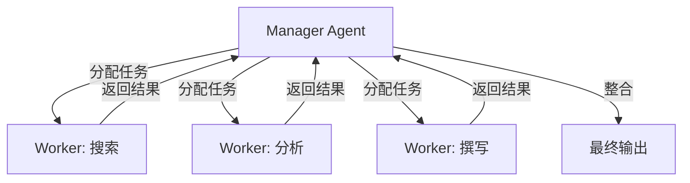

# 多 Agent 系统

让多个 AI 助手分工合作，像一个团队一样完成复杂任务。比如一个负责查资料、一个负责写代码、一个负责审核，各司其职，比单个 AI 单打独斗效率高得多。

> 面向开发者的技术实战文章

## 概述

**多 Agent 系统（Multi-Agent System，MAS）** 是由多个独立的 AI Agent 组成的协作架构，这些 Agent 能够相互通信、协调行动、共享信息，共同完成单个 Agent 无法独立处理的复杂任务。

与单 Agent 系统的核心区别在于**分工与协作**。单 Agent 需要同时具备多种能力（搜索、分析、编码、写作等），而多 Agent 系统可以让每个 Agent 专注于特定领域，通过组合多个"专家"来解决更复杂的问题。

> 💡 类比理解
>
> 单 Agent 像一个全栈工程师，什么都会但深度有限；多 Agent 系统像一个完整团队，有产品经理、设计师、前端工程师、后端工程师，各司其职又协同工作。

## 为什么需要

### 突破单 Agent 的能力瓶颈

单 Agent 面临三个根本性限制：

**上下文窗口限制** 即使 200K token 的上下文窗口，也无法容纳大型项目的所有代码和业务逻辑。多 Agent 系统通过分工，每个 Agent 只处理自己负责的部分，有效规避了上下文限制。

**角色冲突** 同一个 Agent 同时扮演"创作者"和"审核者"角色时，容易出现盲点。多 Agent 系统中，不同 Agent 可以持有不同视角，相互校验。

**任务复杂度爆炸** 当任务涉及多个领域（如"开发一个 Web 应用并部署上线"），单 Agent 需要在不同技能间频繁切换，效率低下且容易出错。

### 核心价值

**专业化分工** 每个 Agent 可以配置不同的系统提示词（System Prompt）、工具集和知识库，专注于特定领域。例如代码 Agent 专注于编码，测试 Agent 专注于测试用例生成。

**并行处理** 多个 Agent 可以同时处理独立子任务，显著缩短整体执行时间。例如文档翻译任务可以按章节拆分，多个翻译 Agent 并行工作。

**容错与冗余** 某个 Agent 失败时，其他 Agent 可以继续工作，或者由备用 Agent 接管。这比单 Agent 失败导致整个任务中断要可靠得多。

**涌现行为（Emergent Behavior）** 多个 Agent 的交互可能产生单个 Agent 不具备的能力。例如辩论式架构中，两个 Agent 相互质疑，最终得出比任一 Agent 单独思考更优的结论。

## 核心原理

### 协作式架构（Collaborative）

多个 Agent 共享同一目标，通过分工协作完成任务。这是最常见的模式。

```python
# 协作式多 Agent 示例：内容创作团队
class ContentTeam:
    def __init__(self):
        self.researcher = Agent(role="研究员", tools=["search", "web_scraper"])
        self.writer = Agent(role="写作者", tools=["text_editor"])
        self.reviewer = Agent(role="审核员", tools=["grammar_checker", "fact_checker"])

    def create_article(self, topic: str) -> str:
        # 研究员收集资料
        research = self.researcher.execute(f"收集关于 {topic} 的资料")

        # 写作者基于资料撰写
        draft = self.writer.execute(f"根据以下资料撰写文章：\n{research}")

        # 审核员检查质量
        feedback = self.reviewer.execute(f"审核以下文章：\n{draft}")

        # 根据反馈修改
        if feedback.needs_revision:
            return self.writer.execute(f"根据反馈修改：\n{feedback.suggestions}\n\n原文：\n{draft}")
        return draft
```

协作式架构的关键设计点：

- 明确每个 Agent 的**职责边界**
- 定义清晰的**输入输出格式**
- 建立有效的**信息传递机制**

### 分层式架构（Hierarchical）

存在一个**管理者 Agent（Manager Agent）** 负责任务分解和分配，多个**执行者 Agent（Worker Agent）** 负责具体执行。



分层式架构的优势：

- **集中控制**：Manager 掌握全局状态，便于协调
- **易于扩展**：添加新的 Worker 不影响整体架构
- **职责清晰**：Manager 负责规划，Worker 负责执行

> ⚠️ 注意：Manager Agent 本身可能成为瓶颈。当任务过于复杂时，可以考虑多层管理架构。

### 辩论式架构（Debate）

多个 Agent 持有不同观点，通过辩论达成共识或最优解。特别适合需要深度思考的场景。

```python
# 辩论式架构示例
def debate_decision(question: str, rounds: int = 3) -> str:
    pro_agent = Agent(role="正方", system_prompt="你总是支持这个观点")
    con_agent = Agent(role="反方", system_prompt="你总是反对这个观点")
    judge_agent = Agent(role="裁判", system_prompt="你客观评估双方论点")

    pro_args = pro_agent.execute(f"支持：{question}")
    con_args = con_agent.execute(f"反对：{question}")

    for _ in range(rounds):
        pro_args = pro_agent.execute(f"反驳对方：{con_args}\n坚持己方：{pro_args}")
        con_args = con_agent.execute(f"反驳对方：{pro_args}\n坚持己方：{con_args}")

    return judge_agent.execute(f"评估双方论点，给出结论：\n正方：{pro_args}\n反方：{con_args}")
```

### 共享内存架构（Shared Memory）

多个 Agent 共享一个**黑板（Blackboard）** 或**消息总线（Message Bus）**，通过读写共享空间进行协作。

```python
# 共享内存架构示例
class Blackboard:
    def __init__(self):
        self.data: dict[str, Any] = {}
        self.lock = asyncio.Lock()

    async def write(self, key: str, value: Any, agent_id: str):
        async with self.lock:
            self.data[key] = {"value": value, "author": agent_id}

    async def read(self, key: str) -> dict | None:
        async with self.lock:
            return self.data.get(key)

# 多个 Agent 读写共享黑板
async def collaborative_task(blackboard: Blackboard):
    agent_a = Agent(name="数据收集器")
    agent_b = Agent(name="数据分析器")

    # Agent A 写入数据
    await blackboard.write("raw_data", collect_data(), agent_a.id)

    # Agent B 读取并处理
    data = await blackboard.read("raw_data")
    result = agent_b.execute(f"分析数据：{data}")
    await blackboard.write("analysis", result, agent_b.id)
```

## 主流框架与实现

### LangGraph

[LangGraph](https://langchain-ai.github.io/langgraph/) 是 LangChain 团队推出的多 Agent 编排框架，基于**有向图（Directed Graph）** 模型。

核心概念：

- **节点（Node）**：代表一个 Agent 或一个操作
- **边（Edge）**：定义节点间的流转关系
- **状态（State）**：在节点间传递的共享数据

```python
from langgraph.graph import StateGraph, END
from typing import TypedDict

class AgentState(TypedDict):
    task: str
    results: list[str]
    current_step: int

def researcher_node(state: AgentState) -> AgentState:
    result = search_web(state["task"])
    state["results"].append(result)
    state["current_step"] += 1
    return state

def writer_node(state: AgentState) -> AgentState:
    draft = write_article(state["results"])
    state["results"].append(draft)
    state["current_step"] += 1
    return state

# 构建图
graph = StateGraph(AgentState)
graph.add_node("research", researcher_node)
graph.add_node("write", writer_node)
graph.add_edge("research", "write")
graph.add_edge("write", END)

app = graph.compile()
result = app.invoke({"task": "AI 趋势分析", "results": [], "current_step": 0})
```

### CrewAI

[CrewAI](https://docs.crewai.com/) 专注于**角色扮演式**的多 Agent 协作，每个 Agent 有明确的角色、目标和工具集。

```python
from crewai import Agent, Task, Crew

# 定义角色
researcher = Agent(
    role="高级研究员",
    goal="深入调研 {topic} 领域的最新进展",
    backstory="你是一位有 10 年经验的技术研究员",
    tools=[search_tool],
    verbose=True
)

writer = Agent(
    role="技术作家",
    goal="基于调研结果撰写高质量技术文章",
    backstory="你擅长将复杂技术概念用通俗语言表达",
    tools=[writing_tool],
    verbose=True
)

# 定义任务
research_task = Task(
    description="调研 {topic} 的最新技术趋势",
    agent=researcher,
    expected_output="一份详细的技术调研报告"
)

writing_task = Task(
    description="基于调研报告撰写文章",
    agent=writer,
    expected_output="一篇 3000 字的技术文章",
    context=[research_task]  # 依赖前一个任务的结果
)

# 组建团队
crew = Crew(
    agents=[researcher, writer],
    tasks=[research_task, writing_task],
    process=Process.sequential  # 顺序执行
)

result = crew.kickoff(inputs={"topic": "大语言模型"})
```

### AutoGen

[AutoGen](https://microsoft.github.io/autogen/) 是微软推出的多 Agent 框架，核心特色是**对话驱动**的 Agent 协作。

```python
from autogen import AssistantAgent, UserProxyAgent, config_list_from_json

config_list = config_list_from_json(env_or_file="OAI_CONFIG_LIST")

# 助手 Agent
assistant = AssistantAgent(
    name="assistant",
    llm_config={"config_list": config_list}
)

# 用户代理（可执行代码）
user_proxy = UserProxyAgent(
    name="user_proxy",
    code_execution_config={"work_dir": "coding"}
)

# 发起对话
user_proxy.initiate_chat(
    assistant,
    message="请帮我分析这个数据集并生成可视化图表"
)
```

AutoGen 的独特之处：

- **对话模式**：Agent 通过对话协作，而非显式的任务分配
- **代码执行**：UserProxyAgent 可以执行代码并返回结果
- **灵活拓扑**：支持任意 Agent 间的多轮对话

### MetaGPT

[MetaGPT](https://github.com/geekan/MetaGPT) 采用**软件公司**的隐喻，定义了产品经理、架构师、工程师、QA 等角色。

```python
from metagpt.roles import ProductManager, Architect, Engineer, QAEngineer
from metagpt.team import Team

# 组建软件公司
team = Team()
team.hire([
    ProductManager(),
    Architect(),
    Engineer(n_borg=2),  # 2 个工程师
    QAEngineer()
])

# 下达需求
team.run_project("开发一个待办事项管理 Web 应用")
```

MetaGPT 的特点：

- **标准化 SOP**：模拟真实软件公司的标准作业流程
- **结构化输出**：每个角色产出标准格式的文档（PRD、设计文档、代码等）
- **端到端**：从需求到代码到测试的完整流程

## 实施步骤

### 步骤 1：明确任务边界与分工

在构建多 Agent 系统前，先回答以下问题：

- 任务可以拆分为哪些独立子任务？
- 每个子任务需要什么专业技能？
- 子任务之间存在什么依赖关系？

```python
# 任务分解示例
task_breakdown = {
    "research": {"agent": "researcher", "tools": ["search", "web_scraper"], "depends_on": []},
    "analysis": {"agent": "analyst", "tools": ["data_analyzer"], "depends_on": ["research"]},
    "writing": {"agent": "writer", "tools": ["text_editor"], "depends_on": ["analysis"]},
    "review": {"agent": "reviewer", "tools": ["grammar_checker"], "depends_on": ["writing"]}
}
```

### 步骤 2：设计 Agent 角色与配置

为每个 Agent 定义清晰的职责边界：

```python
class AgentConfig:
    def __init__(self, name: str, role: str, system_prompt: str, tools: list[str]):
        self.name = name
        self.role = role
        self.system_prompt = system_prompt  # 定义 Agent 的行为准则
        self.tools = tools  # 可用工具集
        self.max_tokens = 4000  # 上下文限制

# 配置示例
researcher_config = AgentConfig(
    name="researcher",
    role="高级研究员",
    system_prompt="你是一位资深技术研究员，擅长收集和分析技术趋势。",
    tools=["web_search", "arxiv_search", "web_scraper"]
)
```

### 步骤 3：选择通信机制

根据场景复杂度选择通信方式：

| 场景 | 推荐机制 | 优点 | 缺点 |
|------|---------|------|------|
| 简单流水线 | 直接调用 | 实现简单 | 耦合度高 |
| 需要解耦 | 消息队列 | 异步、可扩展 | 增加复杂度 |
| 频繁共享状态 | 共享黑板 | 信息透明 | 并发控制复杂 |

### 步骤 4：实现编排逻辑

使用框架（如 LangGraph）或自研编排器：

```python
from langgraph.graph import StateGraph, END

# 定义状态
class TeamState(TypedDict):
    task: str
    research_result: str
    analysis_result: str
    draft: str
    final_output: str

# 构建图
graph = StateGraph(TeamState)
graph.add_node("research", researcher_node)
graph.add_node("analyze", analyst_node)
graph.add_node("write", writer_node)
graph.add_node("review", reviewer_node)

graph.add_edge("research", "analyze")
graph.add_edge("analyze", "write")
graph.add_edge("write", "review")
graph.add_edge("review", END)

app = graph.compile()
```

### 步骤 5：添加可观测性与监控

```python
class MultiAgentMonitor:
    def __init__(self):
        self.metrics = {
            "agent_calls": {},
            "errors": [],
            "costs": {},
            "latencies": []
        }

    def record_call(self, agent_name: str, duration: float, cost: float):
        self.metrics["agent_calls"][agent_name] = \
            self.metrics["agent_calls"].get(agent_name, 0) + 1
        self.metrics["costs"][agent_name] = \
            self.metrics["costs"].get(agent_name, 0) + cost
        self.metrics["latencies"].append(duration)
```

### 步骤 6：测试与迭代

- **单元测试**：每个 Agent 独立测试
- **集成测试**：测试 Agent 间的协作
- **端到端测试**：验证完整流程
- **压力测试**：模拟高并发场景

## 主流框架对比

| 框架 | 核心模式 | 适用场景 | 学习曲线 | 生态 |
|------|---------|---------|---------|------|
| **LangGraph** | 有向图/状态机 | 需要精细控制流程 | 中等 | 丰富（LangChain 生态） |
| **CrewAI** | 角色扮演 | 内容创作、调研 | 低 | 增长中 |
| **AutoGen** | 对话驱动 | 代码生成、数据分析 | 中等 | 微软支持 |
| **MetaGPT** | 软件公司隐喻 | 软件开发全流程 | 较高 | 开源社区 |
| **OpenAI Swarm** | 轻量级编排 | 简单多 Agent 场景 | 低 | OpenAI 生态 |

## 最佳实践

### Agent 通信机制

多 Agent 系统的核心挑战之一是**如何通信**。常见模式：

**直接调用** 一个 Agent 直接调用另一个 Agent 的方法。简单但耦合度高。

```python
# 直接调用模式
result = agent_b.execute(agent_a.execute(input_data))
```

**消息队列** 通过消息中间件（如 Redis、RabbitMQ）异步通信。解耦但增加复杂度。

```python
# 消息队列模式
async def agent_worker(queue: asyncio.Queue, agent: Agent):
    while True:
        message = await queue.get()
        result = await agent.execute(message)
        await result_queue.put(result)
```

**共享状态** 多个 Agent 读写共享状态对象。适合需要频繁共享中间结果的场景。

> 🔧 最佳实践：对于简单场景使用直接调用，对于需要解耦和扩展的场景使用消息队列，对于需要频繁共享中间结果的场景使用共享状态。

### 状态管理与数据流

多 Agent 系统中，**状态管理**是避免混乱的关键：

```python
class MultiAgentOrchestrator:
    def __init__(self):
        self.agents: dict[str, Agent] = {}
        self.state: dict[str, Any] = {}
        self.execution_log: list[dict] = []

    def register_agent(self, name: str, agent: Agent):
        self.agents[name] = agent

    def execute_pipeline(self, pipeline: list[tuple[str, str]]) -> dict:
        """执行 Agent 流水线
        pipeline: [(agent_name, input_key), ...]
        """
        for agent_name, input_key in pipeline:
            agent = self.agents[agent_name]
            input_data = self.state.get(input_key)

            result = agent.execute(input_data)
            self.state[f"{agent_name}_output"] = result
            self.execution_log.append({
                "agent": agent_name,
                "input": input_key,
                "output_key": f"{agent_name}_output",
                "status": "success"
            })

        return self.state
```

### 冲突解决策略

当多个 Agent 对同一问题给出不同答案时，需要冲突解决机制：

**投票机制** 多个 Agent 投票，取多数意见。

```python
def vote_resolution(agents: list[Agent], question: str) -> str:
    votes = [agent.answer(question) for agent in agents]
    return Counter(votes).most_common(1)[0][0]
```

**加权决策** 根据 Agent 的专业度赋予不同权重。

```python
def weighted_decision(agents: list[Agent], weights: list[float], question: str) -> str:
    scores = {}
    for agent, weight in zip(agents, weights):
        answer = agent.answer(question)
        scores[answer] = scores.get(answer, 0) + weight
    return max(scores, key=scores.get)
```

**仲裁者模式** 引入专门的仲裁 Agent 做最终决策。

### 可观测性与调试

多 Agent 系统的调试比单 Agent 困难得多，需要完善的可观测性：

```python
class AgentObservability:
    def __init__(self):
        self.traces: list[dict] = []

    def trace_agent_call(self, agent_name: str, input_data: Any, output: Any, duration: float):
        self.traces.append({
            "agent": agent_name,
            "input": str(input_data)[:500],  # 截断避免过大
            "output": str(output)[:500],
            "duration_ms": duration * 1000,
            "timestamp": datetime.now().isoformat()
        })

    def generate_trace_report(self) -> str:
        total_calls = len(self.traces)
        avg_duration = sum(t["duration_ms"] for t in self.traces) / total_calls
        return f"总调用次数：{total_calls}，平均耗时：{avg_duration:.0f}ms"
```

> 🔧 工具推荐：[LangSmith](https://smith.langchain.com/) 提供多 Agent 调用的可视化追踪，[OpenTelemetry](https://opentelemetry.io/) 可用于构建自定义的可观测性方案。

### 成本控制

多 Agent 系统会显著增加 API 调用成本，需要优化策略：

**缓存复用** 相同输入直接返回缓存结果。

**小模型优先** 简单任务使用小模型，复杂任务才调用大模型。

**批量处理** 合并多个 Agent 的请求，减少 API 调用次数。

```python
class CostOptimizer:
    def __init__(self):
        self.cache: dict[str, Any] = {}
        self.cost_tracker: dict[str, float] = {}

    def execute_with_cache(self, agent: Agent, input_data: str) -> Any:
        cache_key = hash(input_data)
        if cache_key in self.cache:
            return self.cache[cache_key]

        result = agent.execute(input_data)
        self.cache[cache_key] = result

        # 记录成本
        self.cost_tracker[agent.name] = self.cost_tracker.get(agent.name, 0) + agent.last_cost
        return result
```

## 常见问题与避坑

### Q1：Agent 数量越多越好吗？

**不是**。Agent 数量增加会带来：
- 通信开销呈指数增长
- 调试难度急剧上升
- API 成本线性增加

**建议**：从 2-3 个 Agent 开始，只在必要时扩展。

### Q2：如何处理 Agent 间的冲突？

当多个 Agent 对同一问题给出不同答案时：

```python
# 投票机制
def vote_resolution(agents: list[Agent], question: str) -> str:
    votes = [agent.answer(question) for agent in agents]
    return Counter(votes).most_common(1)[0][0]
```

**建议**：引入仲裁者 Agent 或设置权重决策。

### Q3：上下文窗口不够用怎么办？

- 使用**摘要压缩**：将早期对话压缩为摘要
- **分层记忆**：只保留关键信息
- **任务拆分**：将大任务拆为小任务，每个 Agent 处理一部分

### Q4：如何控制多 Agent 系统的成本？

- **缓存复用**：相同输入返回缓存结果
- **小模型优先**：简单任务用小模型
- **设置预算上限**：监控 API 花费

### Q5：调试多 Agent 系统太困难怎么办？

- 使用 [LangSmith](https://smith.langchain.com/) 等可视化工具
- 记录每个 Agent 的输入输出
- 添加详细的执行日志
- 从单 Agent 开始，逐步增加

:::warning 常见陷阱
- **过度设计**：简单任务不需要多 Agent
- **职责不清**：Agent 边界模糊导致重复工作
- **缺乏监控**：出问题后无法定位原因
- **忽视成本**：多 Agent 系统成本可能是单 Agent 的数倍
:::

## 与其他概念的关系

**核心依赖**：

- [Agent](/glossary/agent) — 多 Agent 系统的基础构建单元，每个节点都是一个独立的 Agent
- [Agent 编排](/glossary/agent-orchestration) — 多 Agent 系统需要编排层来协调 Agent 间的协作流程
- [工具使用](/glossary/tool-use) — 每个 Agent 需要工具来扩展自身能力

**应用场景**：

- [自主 Agent](/glossary/autonomous-agent) — 多 Agent 系统是实现高级自主能力的重要架构
- [人机协作](/glossary/human-in-the-loop) — 人类可以作为特殊节点加入多 Agent 系统

**技术基础**：

- [记忆](/glossary/memory) — Agent 间共享记忆是实现深度协作的关键
- [规划](/glossary/planning) — 多 Agent 系统需要更复杂的规划能力来协调多个执行单元

## 延伸阅读

- [Agent 智能体专题](/agent/)
- [LangGraph 官方文档](https://langchain-ai.github.io/langgraph/)
- [CrewAI 官方文档](https://docs.crewai.com/)
- [AutoGen 官方文档](https://microsoft.github.io/autogen/)
- [MetaGPT GitHub 仓库](https://github.com/geekan/MetaGPT)
- [Multi-Agent Survey 论文](https://arxiv.org/abs/2309.07868)
