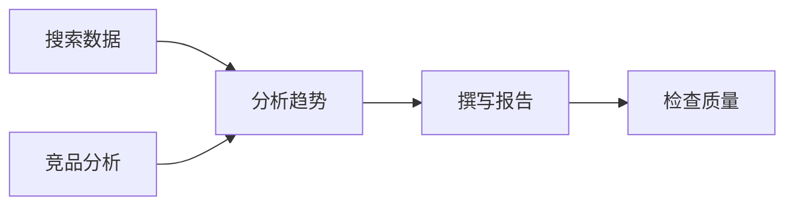

# 规划

AI 接到复杂任务后，自己拆解成一步步该做什么的能力。就像你接到一个项目，会先想清楚先调研、再设计、最后执行一样，AI 也需要学会"先做什么、后做什么"，而不是盲目行动。

> 面向开发者的技术实战文章

## 概述

**规划（Planning）** 是 AI Agent 将复杂任务分解为可执行的子步骤，并制定合理执行策略的能力。在 Agent 架构中，规划扮演着核心认知角色的位置，连接感知与执行两个环节。

与传统程序设计不同，传统的程序是预定义的执行流程，而规划是**动态生成**执行路径。程序只需要按照写好的代码执行，而 Agent 需要根据用户目标自主决定"先做什么、后做什么"。这种能力使 Agent 能够处理开放式任务，而不是被限制在固定的响应模式中。

## 为什么重要

### Agent 能力的分水岭

规划能力是区分"智能工具"和"智能 Agent"的关键分水岭。一个没有规划能力的 Agent 充其量只是一个更智能的搜索引擎——它能回答问题，但无法完成需要多步骤的复杂任务。

> **简单问答 Agent**：用户问"帮我查资料"，Agent 返回结果，任务结束
> **规划型 Agent**：用户说"帮我写一份竞品分析报告"，Agent 自动分解为「搜索竞品信息→整理产品特点→分析市场趋势→撰写报告→检查质量」等步骤并逐步执行

### 核心价值

**任务分解** 是规划最直观的价值。人类的"写一份市场分析报告"在 Agent 眼中是一团模糊的目标，需要分解为「收集数据→分析趋势→撰写报告→检查质量」这样的具体步骤，每个步骤还可以继续细化。

**策略制定** 体现在根据任务特点选择最优执行路径。例如某些任务可以并行处理以提高效率，而另一些任务存在依赖关系必须串行。规划能力让 Agent 理解这些约束并做出合理决策。

**动态调整** 是现代 Agent 的重要特征。传统的工作流是静态的，而规划型 Agent 能够根据执行结果实时修订计划。如果某个步骤失败，Agent 会分析原因并调整后续方案。

**长期目标** 支持需要数小时甚至数天完成的多步骤任务。这种能力对于构建真正的"数字员工"至关重要。

## 核心技术

### 任务分解（Task Decomposition）

任务分解是将复杂目标转换为可执行步骤的过程。主要有三种策略：

**自上而下（Top-down）** 是最常用的方式。先将任务拆分为主要阶段，再逐层细化。例如：

```text
"写一份市场分析报告"
  → "研究" + "撰写" + "校对"
    → "搜索数据" + "整理 insights" + "写大纲" + "填充内容" + "检查格式"
      → [进一步细化为具体可执行动作]
```

**自下而上（Bottom-up）** 适用于不确定最终目标的情况。先识别可用的原子动作，然后逐步组合成解决方案。

**递归分解** 对于非常复杂的任务，可以递归分解直到每个子任务足够小、足够清晰。

> 💡 代码示例：使用 LLM 进行任务分解的 prompt 模板
>
> ```python
> def decompose_task(task: str) -> list[str]:
>     prompt = f"""将以下任务分解为 3-7 个可执行的子步骤。
>     每个步骤应该是具体的、可验证的动作。
>
>     任务：{task}
>
>     输出格式：每行一个步骤，用动词开头"""
>     response = llm.invoke(prompt)
>     return response.strip().split('\n')
> ```

### 依赖分析（Dependency Analysis）

任务分解后，需要分析子任务之间的依赖关系，构建**有向无环图（DAG）**。



在这个例子中，"搜索数据"和"竞品分析"可以并行执行，但都必须完成才能进入"分析趋势"阶段。

依赖分析的关键问题：

- 哪些任务可以并行？
- 任务之间的数据如何传递？
- 某个任务失败如何影响整体？

### 路径规划（Path Planning）

确定了任务及其依赖后，需要找到最优的执行路径。

**传统搜索算法** 如 BFS、DFS 适用于确定性任务空间。在 Agent 场景中，任务空间通常太大且不确定。

**启发式搜索** 如 A\* 算法通过启发式函数加速搜索。但设计有效的启发函数本身是挑战。

**LLM 驱动** 是当前主流方案。利用大语言模型的推理能力，让模型直接生成执行计划：

> 💡 代码示例：基于 LLM 的路径规划
>
> ```python
> def plan_execution(task: str, tools: list[str]) -> list[dict]:
>     prompt = f"""用户任务：{task}
>     可用工具：{', '.join(tools)}
>
>     请制定执行计划。输出 JSON 数组，每个元素包含：
>     - step: 步骤描述
>     - tool: 使用的工具
>     - depends_on: 依赖的前置步骤索引"""
>     response = llm.invoke(prompt, format="json")
>     return json.loads(response)
> ```

### 反思机制（Reflection）

反思机制让 Agent 评估执行结果并动态调整计划，是区别"自动化"和"自主化"的关键。

**执行结果评估**：每次步骤执行后，判断是否成功。成功则继续，失败则分析原因。

**计划修订**：根据反馈调整后续步骤。例如某搜索工具返回结果太少，自动切换到另一个搜索工具。

**错误恢复**：遇到失败时，不是简单放弃，而是尝试其他路径。这需要维护一个"已尝试路径"的记录。

> 🔧 最佳实践：反思机制的实现模式
>
> ```python
> def execute_with_reflection(task: str, max_retries: int = 3):
>     plan = create_initial_plan(task)
>     executed_steps = []
>
>     for step in plan:
>         for attempt in range(max_retries):
>             result = execute_step(step)
>
>             if result.success:
>                 executed_steps.append(result)
>                 # 更新上下文，准备下一步
>                 context.update(result.output)
>                 break
>             elif is_recoverable(result.error):
>                 # 调整计划，尝试其他方法
>                 adjust_plan(step, result.error)
>             else:
>                 # 不可恢复的错误
>                 raise ExecutionError(result.error)
>
>     return aggregate_results(executed_steps)
> ```

## 主流框架与实现

### ReAct（Reasoning + Acting）

ReAct 是当前最流行的 Agent 推理模式之一，由普林斯顿大学提出（[论文](https://arxiv.org/abs/2210.03629)）。

核心思想是**交错进行推理和行动**：

1. **推理**：思考当前状态和下一步应该做什么
2. **行动**：执行一个动作（如调用工具）
3. **观察**：获取行动结果
4. 回到步骤 1

```python
# ReAct 循环的简化实现
def react_loop(task: str, max_iterations: int = 10):
    context = {"task": task, "thoughts": [], "actions": []}

    for _ in range(max_iterations):
        # 推理：思考下一步
        thought = llm.reason(context)
        context["thoughts"].append(thought)

        # 决定行动
        action = llm.decide_action(context)

        # 执行行动
        if action.type == "finish":
            return action.result
        if action.type == "tool":
            result = execute_tool(action.tool, action.args)
            context["observations"].append(result)

        # 检查是否陷入循环
        if is_looping(context):
            # 触发重新规划
            context = replan(context)
```

ReAct 特别适合需要外部工具的复杂任务，因为它将推理过程显式化，使模型能够根据观察到的结果调整策略。

### CoT（Chain of Thought）

**思维链（Chain of Thought，CoT）** 强调展示推理过程，让模型"先思考再回答"。

与 ReAct 的关键区别：

- CoT 主要用于**推理**，不一定涉及外部行动
- CoT 适合**数学、逻辑**等需要精确推理的任务
- 两者可以结合：CoT 用于推理，ReAct 用于行动

```python
# CoT + 工具使用
def cot_with_tools(task: str):
    # 一步步推理
    thoughts = []
    for step in range(5):
        thought = llm.think(f"""
            任务：{task}
            当前思考：{thoughts}
            请进行下一步推理""")
        thoughts.append(thought)

        # 检查是否需要工具
        if needs_tool(thought):
            tool_result = execute_tool(thought)
            thoughts.append(f"观察：{tool_result}")

    return llm.generate_answer(thoughts)
```

### Plan-and-Execute

Plan-and-Execute 模式采用**两阶段**策略：

1. **规划阶段**：先制定完整的执行计划
2. **执行阶段**：按照计划逐步执行

```python
# Plan-and-Execute 模式
def plan_and_execute(task: str):
    # 阶段 1：制定计划
    plan = llm.generate_plan(task)
    print(f"执行计划：{plan}")

    # 阶段 2：执行计划
    results = []
    for step in plan:
        result = execute(step)
        results.append(result)

        # 可以在这里添加检查点
        if not validate_step(result):
            # 计划需要修订
            plan = llm.revise_plan(plan, result)
            print(f"修订计划：{plan}")

    return aggregate(results)
```

这种模式的优缺点：

- **优点**：执行过程稳定可预测，便于调试和监控
- **缺点**：灵活性较低，plan 和 execute 之间存在信息差

> 📖 相关论文：[ReAct 论文](https://arxiv.org/abs/2210.03629)、[Plan-and-Execute 论文](https://arxiv.org/abs/2308.10156)

## 工程实践

### 规划失败的处理

实际应用中，规划并非总是成功。常见失败模式和应对策略：

**模式 1：重试机制**

```python
def plan_with_retry(task: str, max_retries: int = 3):
    for attempt in range(max_retries):
        try:
            return create_plan(task)
        except PlanningError as e:
            if attempt == max_retries - 1:
                raise
            # 添加更多上下文后重试
            task = f"{task}\n\n注意：上次规划失败，错误：{e}"
```

**模式 2：回退策略**

```python
def execute_with_fallback(task: str):
    try:
        plan = create_plan(task)
        return execute(plan)
    except PlanExecutionError as e:
        # 回退到更简单的计划
        simple_plan = create_simple_plan(task)
        return execute(simple_plan)
```

**模式 3：人工介入**

```python
def execute_with_human(task: str):
    plan = create_plan(task)

    # 关键决策点需要人类确认
    for i, step in enumerate(plan):
        if is_critical_step(step):
            confirm = ask_human(f"确认执行步骤 {i+1}: {step}?")
            if not confirm:
                # 等待人类指令
                step = wait_for_human()

        execute(step)
```

### 规划的可观测性

调试 Agent 的规划行为是出了名的困难。以下是工程实践中的关键实践：

**记录每次规划的输入输出**

```python
def create_plan_with_logging(task: str) -> Plan:
    log = {
        "task": task,
        "timestamp": datetime.now(),
        "model": model_name,
    }

    try:
        plan = llm.create_plan(task)
        log["success"] = True
        log["plan"] = plan
    except Exception as e:
        log["success"] = False
        log["error"] = str(e)

    # 发送到日志系统
    observability.log("planning", log)

    return plan
```

**可视化任务执行状态**

```python
# 使用 Mermaid 可视化任务依赖
def visualize_plan(plan: Plan) -> str:
    lines = ["graph TD"]
    for step in plan.steps:
        lines.append(f"    {step.id}[{step.name}]")

    for dep in plan.dependencies:
        lines.append(f"    {dep.from_id} --> {dep.to_id}")

    return "\n".join(lines)
```

**分析规划成功率**

- 记录规划失败的模式
- 分析哪些类型的任务容易规划失败
- 针对性地优化 prompt 或添加示例

> 🔧 工具推荐：[LangSmith](https://smith.langchain.com/) 提供完整的 Agent 调试和监控能力，[Weave](https://wandb.ai/weave) 是 Weights & Biases 推出的可观测性工具

### 规划与工具使用的配合

规划和工具使用是相辅相成的关系：

```
┌─────────────────────────────────────────────┐
│  规划阶段                                    │
│  "这个任务需要什么工具？"                    │
│  ↓                                          │
│  [决定使用哪些工具]                          │
│  ↓                                          │
├─────────────────────────────────────────────┤
│  执行阶段                                    │
│  [调用工具] → [获取结果]                     │
│  ↓                                          │
│  [基于结果触发下一轮规划]                    │
│  ↓                                          │
│  "工具返回了 X，我接下来应该做什么？"         │
└─────────────────────────────────────────────┘
```

关键设计点：

- 规划时不仅要生成步骤，还要明确**每个步骤使用什么工具**
- 工具返回结果后，触发**反思和重新规划**
- 规划上下文需要包含历史执行结果

> 🔗 相关词条：[工具使用](/glossary/tool-use)、[函数调用](/glossary/function-calling)

## 与其他概念的关系

**核心依赖**：

- [Agent](/glossary/agent) — 规划是 Agent 的核心能力之一，Agent 依赖规划来实现目标导向行为
- [思维链](/glossary/chain-of-thought) — 规划时的推理技术，CoT 帮助模型"想清楚"再行动
- [记忆](/glossary/memory) — 规划需要保持上下文记忆，记住之前的步骤和结果

**应用场景**：

- [自主 Agent](/glossary/autonomous-agent) — 规划是实现自主性的关键能力
- [Agent 编排](/glossary/agent-orchestration) — 多 Agent 场景下的任务分配本质上也是规划问题

**技术基础**：

- [大语言模型](/glossary/llm) — 规划能力的来源，LLM 提供了推理和决策的能力
- [上下文窗口](/glossary/context-window) — 影响规划复杂度，上下文越长，可规划的任务越复杂

## 延伸阅读

- [Agent 智能体专题](/agent/)
- [ReAct 论文](https://arxiv.org/abs/2210.03629)
- [LangChain Agents 文档](https://python.langchain.com/docs/modules/agents)
- [LangSmith 官方文档](https://smith.langchain.com/)
- [AutoGPT GitHub 仓库](https://github.com/Significant-Gravitas/AutoGPT)
